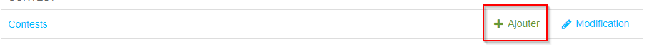

# Spirimove project

*Welcome to the Spirimove project!*

This project is divided in two applications:
- `/backend`: the backend is a Django web application storing the data and providing an API
- `/webclient`: the frontend is a SPA using Vite and React

## High-level architecture

[Click here for PNG](.assets/context-diagram.png)

```plantuml
    !include https://raw.githubusercontent.com/plantuml-stdlib/C4-PlantUML/master/C4_Context.puml

    title System Context diagram for Spirimove

    Person(User, "Spirimove user")
    Person(Admin, "Admin")
    Person(Moderator, "Moderator")
        
    System_Boundary(sm, "Spirimove") {
        System(Frontend, "Frontend", "Web/Mobile application")
        System(Backend, "Backend", "Django web application")
    }

    System_Ext(AzBlob, "Azure Storage", "Stores the images of the participations")
    System_Ext(AzAD, "Spiria Azure Active Directory", "Users authentication source")
    System_Ext(AzDB, "Azure Postgres Database", "Stores data for the Spirimove project")

    Rel(User, Frontend, "uses")
    Rel(Admin, Backend, "administrates contest/moderators")
    Rel(Moderator, Backend, "approves/reject participations")
    Rel_R(Frontend, Backend, "uses API")
    Rel(Frontend, AzAD, "authenticates\nuser")
    Rel(Backend, AzAD, "sync user\nprofile")
    Rel(Backend, AzBlob, "saves")
    BiRel(Backend, AzDB, "reads/writes")
```

## Development setup

Open one of the folder in VS Code. Detailed instructions to get you up and running with the project are in the README files ([backend/README.md](backend/README.md), [webclient/README.md](webclient/README.md)).

## Backend setup

A Django admin interface is available at `https://<backend-hostname>/admin`. 
You will need a superuser to access it the *first time the application is deployed* (or if you flush the database).

You can create a superuser by opening a session into the server (or the container if you're running it locally) and typing:

```shell
python manage.py migrate
python manage.py create superuser
```

You can now login with the credentials you entered and configure the administrator.

## Administrator setup

* Login as superuser in the Django admin site
* Open the *Users* list
* Find the user you want to give the admin role (or create it) and open it (if the future admin already logon once to the app, his user should already exist, if not you can create a new user using his Spiria email and it will get updated with info from Azure the first time he logins)
* Generate a temporary password if you didn't create the user yourself
* In the permissions section, click "Statut équipe" to allow him to login and add the Admin role to his groups 
* Save changes

## Contest and moderators setup

As an administrator, you are responsible to create, open and close contests and designate moderators (this can be yourself). All this is done in the [Django admin site](https://spiri-move-be.azurewebsites.net/admin/)

### Initial contest creation

* Click the link to create a contest 
* Choose a name (usually Spring or Fall), a start and end date and save
* You also need to create the levels defining the numbers of required days to participate in the final lottery draw
* Enter name, prize, number of participation days, a number indicating in what order the prizes are drawn and if this is a prize per office

### Designate moderators

This is similar to the administrator setup, except you need to add the *Moderator* group

## Moderation

As a moderator, you are responsible to approve or reject all participations.
**Participations don't count unless they are approved!**
The lists of participations only show the current contest and are filtered for batch operations.
You approve or reject by selecting the participations and choosing the option in the dropdown at the top of the list.
You can also put back a participation in *Pending* (they don't count and users can edit them)